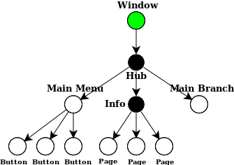

# Structure

A GUI built with hgf takes the form of a tree, where each node is a `StructuralComponent` that is responsible for the children directly underneath it and for reporting information to its parent. For example, a typical application may be structured as below.

  

The application whose structure is depicted above has a root node representing the main window, with one child representing a `Hub` (a logical component for handling navigation by menu) with three children: a main menu, a help page, and an area where the meat of the application resides. Each child component may have further subcomponents, and so on, until an atomic component—or leaf node—is reached.

We can classify components into 3 major categories: *logical*, *atomic*, and *composite*.

## Logical components

The module `hgf.gui` provides some common `StructuralComponent`s that can be composed to build applications like the above. Some of the components are *logical*, like `Hub`. That is, all they do is oversee a collection of children and coordinate between them.

### Purely Structural components

There is a special type of logical component called *purely structural*. A purely structural component, like `Hub`, connects a set of alternatives and provides a way to switch between them.

In the diagram above, the purely structural components are colored black. 'Hub' is a `Hub`, and 'Information' is a `Sequence`. The purely structural components from `hgf.gui.switch` are:

- `Hub`: oversees a central node that can switch to/from every other node
- `Sequence`: oversees a sequence of nodes that can switch to/from their next & previous

And you can create your own purely structural components by subclassing the base class `Switch`!

## Atomic components

A handful of common atomic components (or, leaf nodes) are also provided by `hgf.gui`. They don't do anything interesting, and they have no children. The atomic components from `hgf.gui.text`, `hgf.gui.image` and `hgf.gui.menu` are, respectively:

- `Text`: supports foreground color, font & fontsize to display text
- `Image`: an image
- `Widget`: base class for mouse-interactive components like buttons

To create your own atomic components, you can subclass the base class `StructuralComponent`.

You can subclass `Widget` to create any component that responds to the mouse, like a scrollbar, a slider, a button, etc.

## Composite components

Some components maintain children like purely structural components, but also act as concrete entities with their own functionalities like atomic components. This could be a dialog box with text and a couple of buttons, or a chess board overseeing its chess pieces. The composite components provided by `hgf.gui.menu` are as follows:

- `Button`: sends a message to its parent when clicked
- `Menu`: aggregates buttons; useful as the center node of a `Hub`

## Root component

Finally, at the top of the tree, colored in green in the diagram, is the root component. This is usually `Window` from `hgf.gui.window`.

